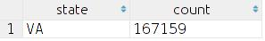
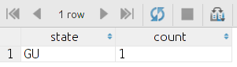
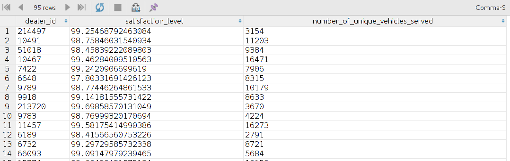

# <u><center> RO Assignment </center></u> #

## Importing data into the database ##
#### Problems while creating table in DB to store data: ####
** a. The first task was to create database table to store the data. **  
While writing CREATE TABLE command: Initially I was thinking about typing the CREATE TABLE command by hand, then I came to know that it can be created using sublime and a small regex in very less time. 

** b. Problems in deciding the data type of columns. **  
Data type of columns was also a problem, first I thought to create those columns as DOUBLE PRECISION type which are looking like numeric and others as VARCHAR, but later I come to know that some columns which should be numeric also contains some non numeric data, then I decided to create all columns as VARCHAR(8000). But due to unclosed quotation marks, this approach also did not work because some rows are going out of range. Then finally I decided to make all columns as TEXT type.

#### Problems in migrating data from CSV file to database: ####
** a. Encoding of data: **  Initially I was trying to insert data with default encoding and continuously getting below error:  
ERROR:  invalid byte sequence for encoding "UTF8": 0x96  
Then in order to solve this problem I had to switch to windows-1251 encoding. 

** b. Size of columns: **  
Initially the data type of column was VARCHAR(8000), and surprisingly some column values are going out of this range. So I need to convert the data type to text, then all data was imported successfully. 

** c. Problem because of not unclosed double quotation marks: **  
Unclosed quotation marks also resulted into a problem, when I noticed that actual number of rows inserted into the database was much less than the number of rows in CSV file. Also when trying to insert part of file like first 80 line into the DB I was getting below error.  
ERROR:  unquoted carriage return found in data  
When searched for the problem I came to know that there was a double quotation mark without any closing quote in line number 17, and same for line number 95 in original file, so COPY command was assuming line 17 to line 95 as single line with quotation pair as single value and because of this reason trying to insert first 80 lines does not have complete row to insert. This problem was at several other places too.
In order to solve this problem. I had to remove all the double quotation marks from the file.


## Analysis of data ##
#### 1 (a).  Name of state with maximum order ####
```sql
 SELECT state,count(*) from RO WHERE state is not NULL GROUP BY state ORDER BY count DESC LIMIT 1; --
```
  <br /><br />
*** Conclusion: ***  
** a. **  This state has higher population as compared to other states.  
--> This state has 12th position in population according to census 2010.  <br /><br />

** b. **  Purchasing power of people of this area is higher as compared to other states.  
--> This state is in top 10 states of USA according to median household income.  <br /><br />


#### 1 (b).  Name of state with minimum order ####
```sql
SELECT state,count(*) from RO WHERE state is not NULL GROUP BY state ORDER BY count LIMIT 1;
```
  <br /><br />
*** Conclusion: ***  
** a. **  This state has least population as compared to other states.  
--> This state has very low population according to census 2010.  <br /><br />

** b. **  Purchasing power of people of this area is lower as compared to other states.  
--> This state is in lowest 10 states of USA according to median household income.  <br /><br />


#### 2 (a).  Top 10 vehicle models which has been serviced least on the basis of covered distance. ####
```sql
DROP TABLE IF EXISTS temporary;

CREATE TEMP TABLE temporary AS SELECT DISTINCT ON (vin) max(mileage::DOUBLE PRECISION) OVER (PARTITION BY vin),count(*) OVER (PARTITION BY vin),vin,model_name from RO WHERE model_name IS NOT NULL;

SELECT sum(max)/sum(count) as result,model_name from temporary GROUP BY model_name ORDER BY result DESC LIMIT 10;

DROP TABLE temporary;
```
  <br /><br />
*** Conclusion: ***  
Since these vehicles have covered maximum distance between two repairs. So we can say that these models have very good quality.


#### 2 (b).  Top 10 vehicle models which has been serviced most on the basis of covered distance. ####
```sql
DROP TABLE IF EXISTS temporary;

CREATE TEMP TABLE temporary AS SELECT DISTINCT ON (vin) max(mileage::DOUBLE PRECISION) OVER (PARTITION BY vin),count(*) OVER (PARTITION BY vin),vin,model_name from RO WHERE model_name IS NOT NULL;

SELECT sum(max)/sum(count) as result,model_name from temporary GROUP BY model_name ORDER BY result LIMIT 10;

DROP TABLE temporary;
```
  <br /><br />
*** Conclusion: ***  
Since these vehicles have covered least distance between two repairs. So we can say that these vehicle don't have good working condition and requires more care.


#### 3.  Top 5 vehicles has been serviced most number of times in warranty period. ####
```sql
DROP TABLE IF EXISTS out_warranty;
DROP TABLE IF EXISTS in_warranty;

CREATE TABLE out_warranty AS SELECT
                               make_name,
                               count(*)
                             FROM RO
                             WHERE warranty_parts_amount :: DOUBLE PRECISION = 0 AND
                                   customer_parts_amount :: DOUBLE PRECISION != 0
                             GROUP BY make_name;

CREATE TABLE in_warranty AS SELECT
                              make_name,
                              count(*)
                            FROM RO
                            WHERE warranty_parts_amount :: DOUBLE PRECISION != 0 AND
                                  customer_parts_amount :: DOUBLE PRECISION = 0
                            GROUP BY make_name;

SELECT *
FROM
  (SELECT
     in_warranty.make_name,
     (in_warranty.count + out_warranty.count)                                                  AS total_orders,
     (in_warranty.count * 100) / (in_warranty.count +
                                  out_warranty.count) :: DOUBLE PRECISION                      AS in_warranty_percentage,
     (out_warranty.count * 100) / (in_warranty.count +
                                   out_warranty.count) :: DOUBLE PRECISION                     AS out_warranty_percentage
   FROM in_warranty
     INNER JOIN out_warranty ON in_warranty.make_name = out_warranty.make_name) AS temp
WHERE total_orders > 50
ORDER BY in_warranty_percentage DESC
LIMIT 5;
```
  <br /><br />
*** Conclusion: ***  
Theses vehicles are not of very good quality because they are requiring maximum repair in their warranty period i.e. when they are new.


#### 4.  State in which a particular part of particular model is failing maximum number of times. ####
```sql
CREATE or REPLACE FUNCTION findStateWiseVehicleCount() RETURNS VOID as $$
    declare
    BEGIN
      INSERT INTO vehicleCount
      SELECT make_name,model_name,state,count(*) from ro where
        make_name is NOT NULL and ro.model_name is NOT NULL and ro.state is NOT NULL
        GROUP BY make_name,model_name,state ORDER BY count;
    END;
$$ LANGUAGE plpgsql;

CREATE OR REPLACE FUNCTION fillPartsData() RETURNS void AS $$
    DECLARE
    x RECORD;
    temp_array text[];
    part text;
    BEGIN
      FOR x in
      SELECT model_name,make_name,state,parts_numbers from ro WHERE parts_numbers is NOT NULL and ro.make_name is NOT NULL and ro.model_name is NOT NULL and ro.state is NOT NULL
      LOOP
        temp_array := string_to_array(x.parts_numbers,'^','');

        FOREACH part in ARRAY temp_array
        LOOP
          IF part is NOT NULL THEN
            INSERT INTO usedPartsInfo VALUES (x.model_name,x.make_name,x.state,part);
          END IF;
        END LOOP;

      END LOOP;
    END;
$$ LANGUAGE plpgsql;

drop TABLE IF EXISTS usedPartsInfo;
drop TABLE IF EXISTS usedPartsCount;
DROP TABLE IF EXISTS vehicleCount;
DROP TABLE IF EXISTS usedPartsRatio;

CREATE TABLE usedPartsInfo(model_name TEXT,make_name text,state text,part text);

SELECT fillPartsData();

CREATE TABLE vehicleCount(make_name TEXT,model_name text,state text,count INTEGER);

SELECT findStateWiseVehicleCount();

create TABLE usedPartsCount as SELECT model_name,make_name,part,state,count(*) FROM usedPartsInfo GROUP BY model_name,make_name,state,part ORDER BY count DESC;

CREATE TABLE usedPartsRatio as SELECT a.model_name,a.make_name,a.part,a.state,(a.count*100)/b.count::DOUBLE PRECISION as percent FROM usedPartsCount a, vehicleCount b WHERE a.model_name=b.model_name AND a.make_name=b.make_name AND a.state=b.state;

SELECT model_name,make_name,part,state,max as part_order_percentage
 from ( SELECT model_name,make_name,part,state,percent,max(percent) OVER
    (PARTITION BY model_name,make_name,part) from usedPartsRatio) as temp where percent=max ORDER BY max DESC;
```
  <br /><br />
*** Conclusion: ***  
From above query we can find out a particular part of vehicle is failing maximum in which state on the basis of vehicles available in that state. This information can be useful in deciding which part of which vehicle needs more improvement for a particular type of environment and road quality in that state.


#### 5.  Trend in payment methods. ####
```sql
CREATE OR REPLACE FUNCTION fillPaymentType() RETURNS VOID AS $$
    DECLARE
      row RECORD;
      temp_array text[];
      payment text;
    BEGIN
      FOR row in
      SELECT state,pay_type FROM ro WHERE state is NOT NULL and ro.pay_type is NOT NULL
        LOOP
          temp_array := string_to_array(row.pay_type,'^','');

          FOREACH payment in ARRAY temp_array
          LOOP
            if payment is NOT NULL THEN
              INSERT INTO paymentTypes values(row.state,payment);
            END IF;
          END LOOP;

      END LOOP;
    END;
$$ LANGUAGE plpgsql;

DROP TABLE IF EXISTS paymentTypes;

CREATE TABLE paymentTypes(state text,type text);

SELECT fillPaymentType();

SELECT
  state,
  (count(CASE WHEN "type" = 'W' THEN "type" END) * 100 / count(*) :: DOUBLE PRECISION) || '%' AS W,
  (count(CASE WHEN "type" = 'C' THEN "type" END) * 100 / count(*) :: DOUBLE PRECISION) || '%' AS C,
  (count(CASE WHEN "type" = 'I' THEN "type" END) * 100 / count(*) :: DOUBLE PRECISION) || '%' AS I,
  count(*) AS total
FROM paymentTypes
GROUP BY state
HAVING count(*)>100
ORDER BY total DESC ;

```
  <br /><br />
*** Conclusion: ***  
From the above table we can find out that customers of a particular state prefers which kind of payment methods.
Then on the basis of this information dealers can provide different kind of payment offers, discounts etc.


#### 6.  States with maximum number of vehicles of a particular model and make. ####
```sql
SELECT
  state,
  make_name,
  model_name,
  count AS number_of_vehicles
FROM
  (SELECT
     make_name,
     model_name,
     state,
     count,
     rank()
     OVER (PARTITION BY state
       ORDER BY count DESC)
   FROM
     (SELECT
        make_name,
        model_name,
        state,
        count(*)
      FROM
        (SELECT DISTINCT ON (vin)
           make_name,
           model_name,
           state,
           vin
         FROM RO
         WHERE
           make_name IS NOT NULL AND model_name IS NOT NULL AND state IS NOT NULL AND vin IS NOT NULL
        ) AS state_wise_vin
      GROUP BY make_name, model_name, state) AS state_wise_model_count) AS state_wise_model_rank
WHERE rank = 1 AND count > 50
ORDER BY count DESC;
```
  <br /><br />
*** Conclusion: ***  
With the help of above information a dealer can identify in which state the sales of vehicle of particular model and make is maximum, so  
** a. **  He can can increase the number of service centers to handle the load on the basis of count of vehicles.  
** b. **  He can provide various kind of offers or discounts to increase his sales even more.  
** c. **  He might think to increase the advertisement and discount of other models so that their sales can also be increased.

#### 7.  Calculation of satisfaction level for each dealer. ####
```sql
SELECT DISTINCT
  dealer_id,
  average AS satisfaction_level,
  number_of_unique_vehicles_served
FROM
  (SELECT
     dealer_id,
     avg(percentage)
     OVER (PARTITION BY dealer_id) AS average,
     count(*)
     OVER (PARTITION BY dealer_id) AS number_of_unique_vehicles_served
   FROM
     (SELECT
        dealer_id,
        count :: DOUBLE PRECISION * 100 / sum(count)
        OVER (PARTITION BY vin) AS percentage
      FROM
        (SELECT
           vin,
           dealer_id,
           count(*)
         FROM ro
         GROUP BY vin, dealer_id) AS vehicle_to_dealer_count
      ORDER BY percentage
     ) AS percentage_value
  ) AS average_value
WHERE number_of_unique_vehicles_served > 100;
```
  <br /><br />
*** Method: ***  
** a. **  This calculation will only be done for those dealers who has served more than 100 distinct vehicles.  
** b. **  For each vehicle find the percent of how many times they have gone to current dealer from how many times they have gone to any dealer.  
** c. **  For each dealer find average of all percentage of vehicles, which has came to him at least once.  
** d. **  Sort the result on the basis of average value.

*** Conclusion: ***  
** a. **  For the dealer which have highest percentage value we can say that his service quality is better because once any goes to him becomes regular customer.  
** b. **  For the dealer having lowest percentage: they have very low service quality, once a customer goes to him never prefers to go again.  


#### 8.  5 most experienced technicians for a particular make, model and op_code. ####
```sql
CREATE OR REPLACE FUNCTION fillTechnicianData() RETURNS VOID as $$
  DECLARE
    i INTEGER;
    row RECORD;
    technicians text[];
    operations text[];
  BEGIN
    FOR row in
    select model_name,make_name,technician_number, op_codes FROM RO
    LOOP
      if row.technician_number is NOT NULL and row.op_codes is NOT NULL THEN
        technicians:=string_to_array(row.technician_number,'^','');
        operations:=string_to_array(row.op_codes,'^','');
        if array_length(technicians,1)=array_length(operations,1) THEN -- if not then information for current row is not consistent
          i:=1;
          WHILE i<=array_length(technicians,1) LOOP
            if technicians[i] is NOT NULL and operations[i] is NOT NULL THEN
              insert into techniciansInfo(model_name, make_name,technician,operation) values (row.model_name,row.make_name,technicians[i],operations[i]);
            END IF;
            i:=i+1;
          END LOOP;
        END IF;
      END IF;
    END LOOP;
  END;
$$ LANGUAGE plpgsql;

DROP TABLE if EXISTS techniciansInfo;

CREATE TABLE techniciansInfo(model_name TEXT, make_name text, technician TEXT,operation TEXT);

SELECT fillTechnicianData();

SELECT  DISTINCT model_name,make_name,operation as op_code,technician,count(*) over w
FROM techniciansInfo
WHERE model_name='SENTRA' and make_name='NISSAN' and operation='39'
WINDOW w as (PARTITION BY technician)
ORDER BY count DESC LIMIT 5;
```
  <br /><br />
*** Conclusion: ***  
Using this table we can find out most experienced person for some operation of a particular model and make. This information can be useful in several ways.


#### 9.  Top 5 vehicle make and models for each dealer of which he is getting maximum orders. ####
```sql
SELECT dealer_id,model_make_names as top_5_model_names_with_maximum_order FROM
  (SELECT
     dealer_id,
     model_make_names,
     count,
     max(count)
     OVER (PARTITION BY dealer_id)
   FROM
     (SELECT
        array_agg(model_make_name)
        OVER w AS model_make_names,
        *
      FROM
        (SELECT
           dealer_id,
           model_name || '[' || make_name || ']' as model_make_name,
           count(*)
         FROM RO
         GROUP BY dealer_id, model_name, make_name) AS modelMakeCount
      WINDOW w AS (
        PARTITION BY dealer_id
        ORDER BY count
        ROWS 4 PRECEDING )
     ) AS infoWithModelNames
  ) as infoWithMaxValue
WHERE count=max;
```
  <br /><br />
*** Conclusion: ***  
Since the dealer is getting maximum order for these make and models as compared to others. So  
** a. **  He can improve his competency for dealing with these vehicles.  
** b. **  He can make stock of parts of these vehicles and rest assured that they will get used.  


#### 10 (a).  Number of orders for a particular part of some make and model in different mileage range. ####
```sql
CREATE OR REPLACE FUNCTION fillMissingIntervals()
  RETURNS VOID AS $$
DECLARE
  max_mileage TEXT;
  max         INTEGER;
  pos         INTEGER;
  m_range     INTEGER;
  counter     INTEGER;
  is_exist    INTEGER;
BEGIN
  m_range:=60000;
  SELECT substring(mileage_range FROM position('-' IN mileage_range) + 1) :: INTEGER AS maximum
  INTO max
  FROM parts_info
  ORDER BY maximum
  DESC
  LIMIT 1;

  counter:=0;
  WHILE counter < max - m_range LOOP
    is_exist:=0;

    SELECT count(*)
    INTO is_exist
    FROM parts_info
    WHERE mileage_range LIKE (counter :: TEXT || '-%');
    IF is_exist = 0
    THEN
      INSERT INTO parts_info (mileage_range, count)
      VALUES (counter :: TEXT || '-' || (counter + m_range - 1) :: TEXT, 0);
    END IF;

    counter:=counter + m_range;
  END LOOP;
END;
$$ LANGUAGE 'plpgsql';


DROP TABLE IF EXISTS parts_info;
create table parts_info as
  (SELECT mileage_range,count(*) from
      (SELECT (((mileage :: INTEGER / 60000) * 60000) :: TEXT || '-' ||
               ((((mileage :: INTEGER / 60000) + 1) * 60000) - 1) :: TEXT)
      as mileage_range
       FROM ro
       WHERE model_name = 'ALTIMA' AND make_name = 'NISSAN' AND parts_numbers LIKE '%NI15208-65F0C%'
      ) as temp GROUP BY mileage_range ORDER BY mileage_range
  );

SELECT fillMissingIntervals();

SELECT * FROM parts_info ORDER BY mileage_range;
```
  <br /><br />
  <br /><br />

*** Conclusion: ***  
By using above graph one can understand in which mileage range that part is failing maximum number of times and what is the trend in the fail rate as the vehicle gets older.


#### 10 (b).  Showing zoomed graph for above analysis i.e. only for first 120000 mileage and interval size is 10000 now. ####
```sql
CREATE OR REPLACE FUNCTION fillMissingIntervals()
  RETURNS VOID AS $$
DECLARE
  max_mileage TEXT;
  max         INTEGER;
  pos         INTEGER;
  m_range     INTEGER;
  counter     INTEGER;
  is_exist    INTEGER;
BEGIN
  m_range:=10000;
  SELECT substring(mileage_range FROM position('-' IN mileage_range) + 1) :: INTEGER AS maximum
  INTO max
  FROM parts_info
  ORDER BY maximum
  DESC
  LIMIT 1;

  counter:=0;
  WHILE counter < max - m_range LOOP
    is_exist:=0;

    SELECT count(*)
    INTO is_exist
    FROM parts_info
    WHERE mileage_range LIKE (counter :: TEXT || '-%');
    IF is_exist = 0
    THEN
      INSERT INTO parts_info (mileage_range, count)
      VALUES (counter :: TEXT || '-' || (counter + m_range - 1) :: TEXT, 0);
    END IF;

    counter:=counter + m_range;
  END LOOP;
END;
$$ LANGUAGE 'plpgsql';

DROP TABLE IF EXISTS parts_info;
create table parts_info as
  (SELECT mileage_range,count(*) from
      (SELECT (((mileage :: INTEGER / 10000) * 10000) :: TEXT || '-' ||
               ((((mileage :: INTEGER / 10000) + 1) * 10000) - 1) :: TEXT)
      as mileage_range
       FROM ro
       WHERE model_name = 'ALTIMA' AND make_name = 'NISSAN' AND parts_numbers LIKE '%NI15208-65F0C%' AND
           mileage::INTEGER<120000
      ) as temp GROUP BY mileage_range ORDER BY mileage_range
  );

SELECT fillMissingIntervals();

SELECT * FROM parts_info ORDER BY mileage_range;
```
  <br /><br />

#### 11 (a).  Number of orders for a particular part for 5 different make and model in different mileage range. ####
```sql
CREATE or REPLACE FUNCTION fillMissingIntervals() RETURNS VOID as $$
    DECLARE
      max_mileage text;
      max INTEGER;
      pos INTEGER;
      m_range INTEGER;
      row RECORD;
      counter INTEGER;
      is_exist INTEGER;
    BEGIN
      m_range:=60000;
      SELECT substring(mileage_range from position('-' in mileage_range)+1)::integer as maximum into max
      from parts_info ORDER BY maximum
      DESC LIMIT 1;

      For row in
      SELECT make_name,model_name,count(*) from ro WHERE parts_numbers LIKE '%NI15208-65F0C%'
      GROUP BY make_name,model_name ORDER BY count DESC LIMIT 5
        LOOP
      counter:=0;
      while counter<=max-m_range+1 LOOP
        is_exist:=0;
                RAISE info 'checking for % % %',row.make_name,row.model_name,counter;
        SELECT count(*) into is_exist from parts_info where
          mileage_range LIKE (counter::text || '-%')
          and make_name=row.make_name and model_name=row.model_name;
                  RAISE info 'found result :%',is_exist;
        if is_exist=0 THEN
                  Raise INFO 'inserting';
          INSERT INTO parts_info(make_name,model_name, mileage_range, count) VALUES (row.make_name,row.model_name,counter::TEXT || '-' || (counter+m_range-1)::Text,0);
        END IF;

        counter:=counter+m_range;
      END LOOP;
      END LOOP;
    END;
$$ LANGUAGE 'plpgsql';


DROP TABLE IF EXISTS parts_info;
create table parts_info as
  (SELECT make_name,model_name,mileage_range,count(*) from
      (SELECT (((mileage :: INTEGER / 60000) * 60000) :: TEXT || '-' ||
               ((((mileage :: INTEGER / 60000) + 1) * 60000) - 1) :: TEXT)
      as mileage_range, make_name,model_name
       FROM ro
       WHERE
         model_name in
          (SELECT DISTINCT model_name FROM
          (SELECT make_name,model_name,count(*) from ro WHERE parts_numbers LIKE '%NI15208-65F0C%' GROUP BY make_name,model_name
          ORDER BY count DESC LIMIT 5) as makeAndModel)

         AND
         make_name in
         (SELECT DISTINCT make_name FROM
          (SELECT make_name,model_name,count(*) from ro WHERE parts_numbers LIKE '%NI15208-65F0C%' GROUP BY make_name,model_name
          ORDER BY count DESC LIMIT 5) as makeAndModel)
        AND
         parts_numbers LIKE '%NI15208-65F0C%'
      ) as temp GROUP BY mileage_range,make_name,model_name ORDER BY mileage_range
  );

SELECT fillMissingIntervals();

SELECT * from parts_info ORDER BY (substring(mileage_range FROM position('-' IN mileage_range) + 1) :: INTEGER);
```
  <br /><br />
  <br /><br />

*** Conclusion: ***  
By using above graph one can understand in which mileage range for which make and model that part is failing maximum number of times and what is the trend in the fail rate as the vehicle gets older.

#### 11 (b).  Showing zoomed graph for above analysis i.e. only for first 150000 mileage and interval size is 20000 now. ####
```sql
CREATE or REPLACE FUNCTION fillMissingIntervals() RETURNS VOID as $$
    DECLARE
      max_mileage text;
      max INTEGER;
      pos INTEGER;
      m_range INTEGER;
      row RECORD;
      counter INTEGER;
      is_exist INTEGER;
    BEGIN
      m_range:=10000;
      SELECT substring(mileage_range from position('-' in mileage_range)+1)::integer as maximum into max
      from parts_info ORDER BY maximum
      DESC LIMIT 1;

      For row in
      SELECT make_name,model_name,count(*) from ro WHERE parts_numbers LIKE '%NI15208-65F0C%'
      GROUP BY make_name,model_name ORDER BY count DESC LIMIT 5
        LOOP
      counter:=0;
      while counter<=max-m_range+1 LOOP
        is_exist:=0;
                RAISE info 'checking for % % %',row.make_name,row.model_name,counter;
        SELECT count(*) into is_exist from parts_info where
          mileage_range LIKE (counter::text || '-%')
          and make_name=row.make_name and model_name=row.model_name;
                  RAISE info 'found result :%',is_exist;
        if is_exist=0 THEN
                  Raise INFO 'inserting';
          INSERT INTO parts_info(make_name,model_name, mileage_range, count) VALUES (row.make_name,row.model_name,counter::TEXT || '-' || (counter+m_range-1)::Text,0);
        END IF;

        counter:=counter+m_range;
      END LOOP;
      END LOOP;
    END;
$$ LANGUAGE 'plpgsql';

DROP TABLE IF EXISTS parts_info;
create table parts_info as
  (SELECT make_name,model_name,mileage_range,count(*) from
      (SELECT (((mileage :: INTEGER / 10000) * 10000) :: TEXT || '-' ||
               ((((mileage :: INTEGER / 10000) + 1) * 10000) - 1) :: TEXT)
      as mileage_range, make_name,model_name
       FROM ro
       WHERE
         model_name in
          (SELECT DISTINCT model_name FROM
          (SELECT make_name,model_name,count(*) from ro WHERE parts_numbers LIKE '%NI15208-65F0C%' GROUP BY make_name,model_name
          ORDER BY count DESC LIMIT 5) as makeAndModel)

         AND
         make_name in
         (SELECT DISTINCT make_name FROM
          (SELECT make_name,model_name,count(*) from ro WHERE parts_numbers LIKE '%NI15208-65F0C%' GROUP BY make_name,model_name
          ORDER BY count DESC LIMIT 5) as makeAndModel)
        AND
         parts_numbers LIKE '%NI15208-65F0C%'
        AND
             mileage::INTEGER<150000
      ) as temp GROUP BY mileage_range,make_name,model_name ORDER BY mileage_range
  );

SELECT fillMissingIntervals();

SELECT * from parts_info ORDER BY (substring(mileage_range FROM position('-' IN mileage_range) + 1) :: INTEGER);
```
  <br /><br />


## Creating clean schema ##

* The first step was to create the new schema in database.  
For this purpose I need to give create permission to the current user on the database. It can be accomplished using below command.  
```sql
GRANT CREATE ON DATABASE test to josh
```

* After that I created new schema using below command
```sql
create schema clean
```

* After that I need to switch to this schema, so that I can access objects in this schema without using schema name.
For this purpose I changed search path so that the first schema in which any object is looked is clean schema using below command.
```sql
Set search_path=clean
```

#### Used user defined functions ####
** (A) To check for proper zip code **
```sql
CREATE OR REPLACE FUNCTION isValidZipcode(text) RETURNS BOOLEAN AS $$
DECLARE
  pos INTEGER;
BEGIN
  if $1 is NULL THEN
    return true;
  end if;
  pos:=position('-' in $1);
  if pos=0 THEN
    return length($1)=5 and isBigInt($1);
  else
    RETURN isBigInt(substring($1 from 1 for 5)) and substring($1 from 6 for 1) like '-'
            and isBigInt(substring($1 from 7 for 4)) and length($1)=10;
  END IF;
END;
$$ LANGUAGE plpgsql;
```

** (B) To check for proper BigInt value **
```sql
CREATE OR REPLACE FUNCTION isbigint(text) RETURNS BOOLEAN AS $$
BEGIN
    $1=$1::BIGINT;
    RETURN TRUE;
EXCEPTION WHEN others THEN
    RETURN FALSE;
END;
$$ LANGUAGE plpgsql;
```

** (C) To check for valid double precision **
```sql
CREATE OR REPLACE FUNCTION isDoublePrecision(text) RETURNS BOOLEAN AS $$
BEGIN
    $1=$1::DOUBLE PRECISION;
    RETURN TRUE;
EXCEPTION WHEN others THEN
    RETURN FALSE;
END;
$$ LANGUAGE plpgsql;
```

** (D) To check for valid date value **
```sql
CREATE OR REPLACE FUNCTION isDate(text) RETURNS BOOLEAN AS $$
BEGIN
    $1=$1::date;
    RETURN TRUE;
EXCEPTION WHEN others THEN
    RETURN FALSE;
END;
$$ LANGUAGE plpgsql;
```

** (E) To check whether a field contains any special symbol **
```sql
CREATE OR REPLACE FUNCTION isContainsSpecialSymbol(text) RETURNS BOOLEAN AS $$
BEGIN
  if $1 ~* '[^a-z0-9]' then
    return true;
  else
    RETURN false;
  END IF;
END;
$$ LANGUAGE plpgsql;
```

** (F) To check whether a field contains any alphabet **
```sql
CREATE or REPLACE FUNCTION isContainsAlphabates(input text) RETURNS BOOLEAN as $$
    DECLARE
    BEGIN
      if input!=upper(input) then
        RETURN true;
      end IF ;
      if input!=lower(input) then
        RETURN true;
      END IF ;
      RETURN false;
    END;
$$ LANGUAGE 'plpgsql';
```

** (G) To check whether a field contains any special symbol except space **
```sql
CREATE OR REPLACE FUNCTION isContainsSpecialSymbolExceptSpace(text) RETURNS BOOLEAN AS $$
BEGIN
  if $1 ~* '[^a-z0-9 ]' then
    return true;
  else
    RETURN false;
  END IF;
END;
$$ LANGUAGE plpgsql;
```

** (H) To check whether a field contains only special symbols **
```sql
CREATE OR REPLACE FUNCTION isContainsOnlySpecialSymbols(text) RETURNS BOOLEAN AS $$
BEGIN
  if $1 is NULL THEN
    RETURN false;
  END IF;
  if $1 ~ '[a-zA-Z0-9]' then
    return false;
  else
    RETURN true;
  END IF;
END;
$$ LANGUAGE plpgsql;
```

** (I) To check whether a field contains any alphabet **
```sql
CREATE OR REPLACE FUNCTION isContainsAnyAlphabets(text) RETURNS BOOLEAN AS $$
BEGIN
  if $1 is NULL THEN
    RETURN false;
  END IF;
  if $1 ~ '[a-zA-Z]' then
    return true;
  else
    RETURN false;
  END IF;
END;
$$ LANGUAGE plpgsql;
```

#### Validation of data in columns ####

** 1. Processing Dealer_Id: **  
&nbsp;&nbsp;&nbsp;&nbsp;> It should be bigInt.
```sql
UPDATE ro_temp SET dealer_id=NULL WHERE not isbigint(dealer_id);
```
(0 rows updated)

** 2. Processing Ro_Number: **  
&nbsp;&nbsp;&nbsp;&nbsp;> All Ro_Number should be bigInt.
```sql
UPDATE ro_temp SET ro_number=NULL WHERE not isbigint(ro_number);
```
(0 rows updated)

** 3. Processing Ro_Close_Date: **  
&nbsp;&nbsp;&nbsp;&nbsp;> Ro_Close_Date should be a valid date.
```sql
UPDATE ro_temp SET ro_close_date=NULL WHERE not isDate(ro_closeDate);
```
(0 rows updated)

** 4. Processing Customer_Num_Dealer: **  
&nbsp;&nbsp;&nbsp;&nbsp;> Checking for possibility of field to be of alpha-numeric type.
```sql
SELECT count(*) from ro_temp where isContainsAlphabates(customer_num_dealer);
```
Above query shows 261869 rows contains alphanumeric data for this field which is 14.09 percent of total.
Hence assuming that column Customer_Num_Dealer is of alpha numeric type.

&nbsp;&nbsp;&nbsp;&nbsp;> Checking for possibility of field to contain special symbols.
```sql
SELECT count(*) from ro_temp where isContainsSpecialSymbol(customer_num_dealer);
```
Above query shows only 171 rows contains alphanumeric data for this field which is 0.009205 percent of total.
Hence assuming that column Customer_Num_Dealer can not contain special symbols and these 171 rows contains special symbols because of some processing error.  
  
Hence replacing these special symbols with blank string using below command.  
```sql
update ro_temp set customer_num_dealer=translate(customer_num_dealer,'-.','') where isContainsSpecialSymbol(customer_num_dealer);
```
(171 rows updated)

** 5. Processing Customer_Full_Name: **  
&nbsp;&nbsp;&nbsp;&nbsp;> Customer name should not contains any special symbol except space.
```sql
update ro_temp set Customer_Full_Name=NULL where isContainsSpecialSymbolExceptSpace(Customer_Full_Name);
```
(0 rows updated)

** 6. Processing County: **  
&nbsp;&nbsp;&nbsp;&nbsp;> Although county name can not contains any special symbols. But still it should not be composed of only special symbols, i.e. it must have some alpha numeric characters too.
```sql
UPDATE ro_temp set county=null WHERE isContainsOnlySpecialSymbols(county);
```
(60 rows updated)

** 7. Processing State: **  
&nbsp;&nbsp;&nbsp;&nbsp;> No state name exist consisting of any special symbol. So we conclude that space names are in consistent state.


** 8. Processing Zip: **  
&nbsp;&nbsp;&nbsp;&nbsp;> Consider below query 
```sql
SELECT count(*) from ro_temp where not isContainsSpecialSymbol(zip) and not isContainsAnyAlphabets(zip) and length(zip)=9;
```
There are 2772 such erroneous zip codes which can be a valid zip code after having a - symbol. Assuming absence of - is because of some process error hence updating them to be a valid zip code using below query.
```sql
UPDATE ro_temp set zip=substring(zip from 1 for 5) || '-' || substring(zip from 6) where not isContainsSpecialSymbol(zip) and not isContainsAnyAlphabets(zip) and length(zip)=9;
```
(2772 rows updated)

** 9. Processing Standardized_Address: **  
&nbsp;&nbsp;&nbsp;&nbsp;> Value of this field must be either Y or N.
```sql
update ro_temp set standardized_address=NULL WHERE standardized_address not in ('Y','N');
```
(0 rows updated)

** 10. Processing VIN: **  
&nbsp;&nbsp;&nbsp;&nbsp;> For vehicles made between 1954-1981 there was no standard format and VIN numbers varied considerably between manufacturers. So we can't validate those vehicles vin number. However every vehicle made in 1981 or later has a unique 17-digit VIN in a fixed format.  
Consider below query
```sql
SELECT count(vin) from ro_temp WHERE not isValidVINNumber(vin);
```
It shows there are 435 distince vin or 929 ro_order rows for which vin numbers may be erroneous. However in absence of proper information we can't make any conclusion.

** 11. Processing Mileage: **  
&nbsp;&nbsp;&nbsp;&nbsp;> Mileage value can't be negative.  
&nbsp;&nbsp;&nbsp;&nbsp;> Mileage value must be a valid double precision number.
```sql
Update ro_temp set mileage=NULL where not isDoublePrecision(mileage) or mileage::DOUBLE PRECISION<0;
```
(0 rows updated)

** 12. Validating ^ separated fields like op_codes, technician_number, pay_type, parts_numbers, labor_time, description_1, description_2, labor_per_op, parts_per_op, unknown_per_op: **  
&nbsp;&nbsp;&nbsp;&nbsp;> All the fields must have equal number of ^ separated information.
```sql
SELECT * from ro_temp WHERE
  array_length(string_to_array(op_codes,'^',''),1)!=array_length(string_to_array(technician_number,'^',''),1) or
  array_length(string_to_array(op_codes,'^',''),1)!=array_length(string_to_array(pay_type,'^',''),1) or
  array_length(string_to_array(op_codes,'^',''),1)!=array_length(string_to_array(parts_numbers,'^',''),1) or
  array_length(string_to_array(op_codes,'^',''),1)!=array_length(string_to_array(labor_time,'^',''),1) or
  array_length(string_to_array(op_codes,'^',''),1)!=array_length(string_to_array(description_1,'^',''),1) or
  array_length(string_to_array(op_codes,'^',''),1)!=array_length(string_to_array(description_2,'^',''),1) or
  array_length(string_to_array(op_codes,'^',''),1)!=array_length(string_to_array(labor_per_op,'^',''),1) or
  array_length(string_to_array(op_codes,'^',''),1)!=array_length(string_to_array(parts_per_op,'^',''),1) or
  array_length(string_to_array(op_codes,'^',''),1)!=array_length(string_to_array(unknown_per_op,'^',''),1);
```
By using above query we get 16 such rows which have inconsistent description i.e. number of descriptions is not equal to number of operation performed.
For the time being we are ignoring this inconsistence. However we can deal with it as needed by the type of analysis.


** 13. Processing Parts_Amount: **  
&nbsp;&nbsp;&nbsp;&nbsp;> Parts_Amount value must be a valid double precision number.
```sql
Update ro_temp set parts_amount=NULL where not isDoublePrecision(parts_amount);
```
(0 rows updated)

&nbsp;&nbsp;&nbsp;&nbsp;> Parts_Amount value can't be negative.
```
SELECT count(*) from public.ro WHERE parts_amount::DOUBLE PRECISION<0 ;
```
Above query shows that we have 1623 values for parts_amount which are negative. But due of absence of proper information we can't make any decision about these values.
